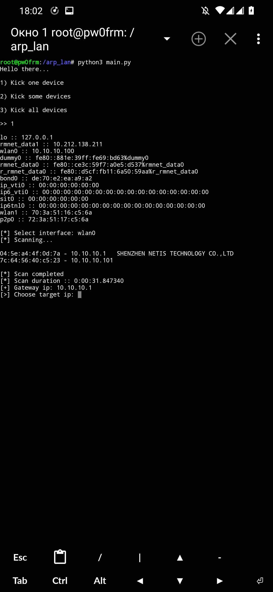

# arp_lan
• A tool to disconnect people from internet access in WiFi/Lan

**Base by [NotCatalyst](https://github.com/NotCatalyst)**

**ARP functions from [wifikill](https://github.com/roglew/wifikill) by [roglew](https://github.com/roglew)**

**Improved and develops: by Mirivan (yeah, it's me😏)**

## Preview

## Requirements
`pip install psutil requests scapy`

## Build date
`11.08.2021`
